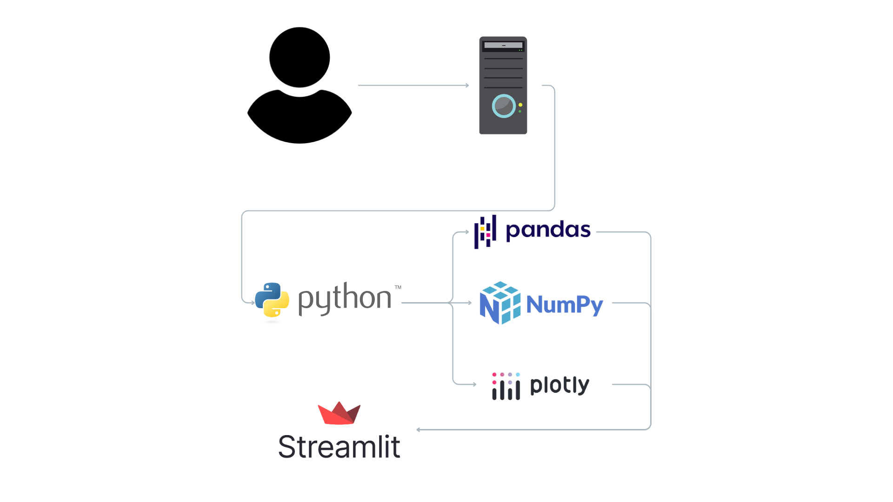
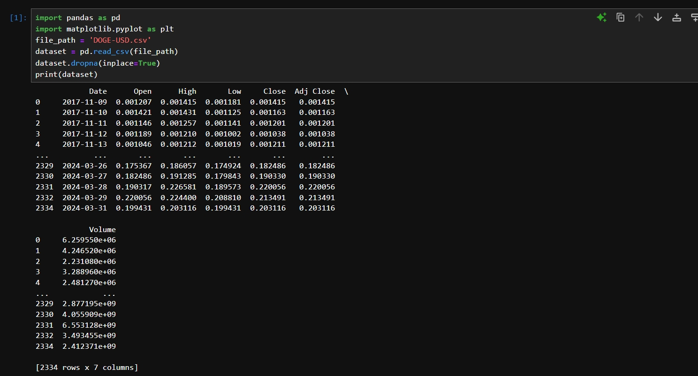
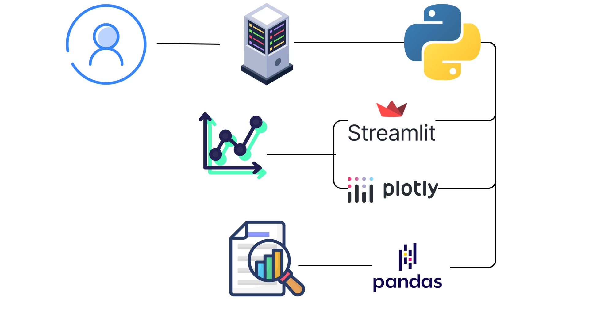

# Análisis predictivo del mercado de la criptomoneda Dogecoin (2024-2030)

## Tabla de Contenidos
1. [Nombre](#nombre)
2. [Descripción](#descripción)
3. [Arquitectura](#arquitectura)
4. [Proceso](#proceso)
5. [Funcionalidades](#funcionalidades)
6. [Estado del Proyecto](#estado-del-proyecto)
7. [Agradecimientos](#agradecimientos)

---

## Nombre
**Análisis predictivo del mercado de la criptomoneda Dogecoin (2024-2030)**

---

## Descripción
**Aplicación web para el análisis estadístico de la criptomoneda Dogecoin y predicción de su precio desde la actualidad hasta el 2030.**

En el presente proyecto se llevará a cabo un análisis estadístico sobre el precio de la criptomoneda Dogecoin, tomando en cuenta sus estadísticas anteriores, presentes y futuras para realizar una predicción de su valor en los próximos 6 años.

---

## Arquitectura
Se utilizaron herramientas como:  
- **Pandas** para el análisis y procesado de los datos.  
- **NumPy** para generar cambios aleatorios en el precio de la criptomoneda. Crea una serie de fluctuaciones simuladas que reflejan la volatilidad del mercado, lo que permite al usuario experimentar con diferentes estrategias de inversión (agresiva, conservadora o normal).  
- **Plotly** para graficar los datos del dataset de una forma dinámica.

---

## Proceso
1. **Fuente del dataset**  
   [Dogecoin Historical Data](https://www.kaggle.com/datasets/dhruvildave/dogecoin-historical-data)

2. **Limpieza de datos**  
     

3. **Manejo de excepciones/control de errores**  
   - Control de errores en la carga de los datos.

4. **Estadísticos (Valores, gráficos, …)**  
   *(Incluye imágenes o ejemplos si aplica)*

---

## Funcionalidades
### Funcionalidades Principales:
- **Análisis estadístico** del precio y volumen de transacciones de la criptomoneda Dogecoin desde sus inicios hasta el año 2024.  
- **Simulación de inversiones** de criptomonedas.  
- **Generación de predicción estadística** del precio de la criptomoneda Dogecoin desde la actualidad hasta el año 2030.  

### Funcionalidades Extra:
#### Integración de datos en Framework Web
- Herramientas utilizadas:  
  - Streamlit  
  - Plotly  
  - Sarimax  

(img)

#### Simulador de Inversiones
- Herramientas utilizadas:  
  - Pandas  
  - NumPy  
  - Plotly  
  - ipywidgets  
  - IPython  
  - Streamlit  

---

## Conclusión
**A lo largo de este proyecto, hemos emprendido un viaje en el mundo de las criptomonedas, centrándonos en Dogecoin y su comportamiento en el mercado. Desde la búsqueda inicial de información en fuentes confiables hasta la recolección y análisis de datos, cada paso ha sido una oportunidad para aprender y crecer como equipo. La colaboración entre todos los miembros ha sido fundamental para el éxito de este análisis. Cada uno aportó sus habilidades únicas, desde la búsqueda y limpieza de datos hasta la creación de visualizaciones interactivas que permiten a los usuarios explorar y comprender mejor las tendencias del mercado. Nuestro objetivo no solo fue proyectar el precio de Dogecoin hasta 2030, sino también ofrecer una herramienta que empodere a los usuarios en su toma de decisiones. Finalmente, este proyecto ha sido más que un simple análisis; ha sido una experiencia transformadora que nos ha permitido crecer como investigadores, analistas y como equipo, esperando así que todo este esfuerzo implementado sea para la ayuda de aquellos que desean invertir en esta emblemática moneda.**

---

## Estado del Proyecto
**Completado**

---

## Agradecimientos
Agradecemos primeramente a **Dios** por darnos inteligencia, al equipo de **Samsung** por la oportunidad, y a nuestros familiares por el constante apoyo.
